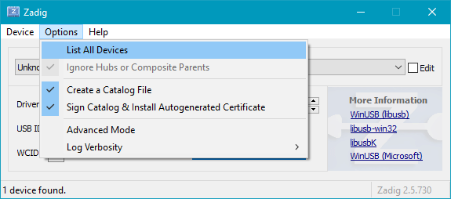
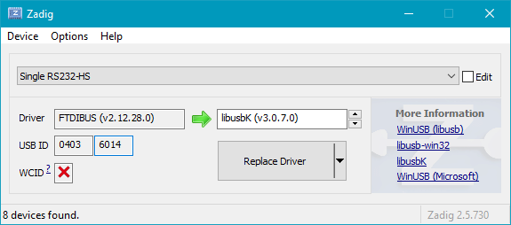
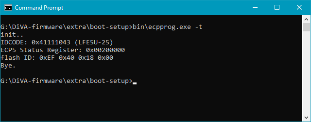
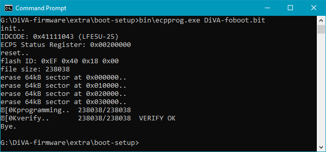
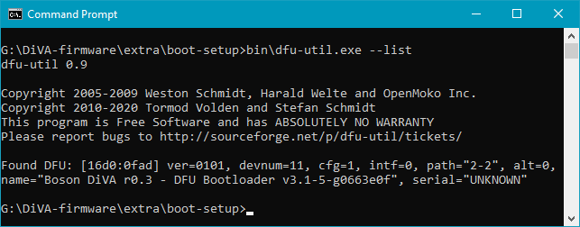
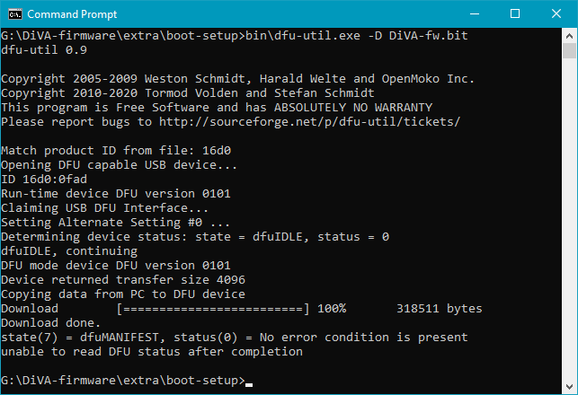

# DiVA Initial Setup Guide

DiVA or the Digital Video Adapter is an addon board for the Boson LWIR core from FLIR.
It features an FPGA that performs the video conversion from the camera to a Digital Video Interface. In order for this to function you will need to load the initial firmware onto the device.

Additionally the board is designed to be user updateable in the field over just a USB connection. In order to accomplish this we need to also load a bootloader onto the device, we'll do this first. 

In order to simplify everything, tools from [Open Tool Forge](https://github.com/open-tool-forge/fpga-toolchain/releases) have been included under `/bin` for Linux and Windows 

## Initial device programming

1. Connect the programming jig to the computer.


2. Place a PCB into the programer, do not connect USB to the PCB, the programmer will supply power.


3. Run this command: 

    Linux:
    ```console 
    $ bin/ecpprog DiVA-foboot.bit
    ```
    Windows:
    ```console 
    > bin\ecpprog.exe DiVA-foboot.bit
    ```

4. Remove the board from the programmer, and then connect it via USB, while holding down the top button.


5. Run dfu-util to load the application firmware and gateware.

    Linux:
    ```console 
    $ bin/dfu-util -D DiVA-fw.bit
    ```
    Windows:
    ```console 
    > bin\dfu-util.exe -D DiVA-fw.bit
    ```


The board will now have a bootloader and it's application firmware loaded.

## Further testing

1. Connect a cable from the board to a monitor, you sholud see an image on the screen
2. Unplug from USB and connect a camera to the board, and fasten the board with 3 M1.6 screws.
3. When you power the board back up you should see an image from the thermal camera, pressing the bottom button will cycle through the on-board palletes on the camera, and holding the bottom button will toggle full-screen scaling.


## Troubleshooting

If you have errors using `dfu-util`, on linux you may need to load some udev rules, using this command, then reconnect the board: 
```console 
$ cp extra/udev-rules/20-diva-bootloader.rules /etc/udev/rules.d/
```

---

When you connect DiVA while holding down the top button the LED should be cycling through Red > Green > Blue. And you should see a DFU device appear
``` console
$ dmesg | tail
  [970.951694] usb 3-1.3: new full-speed USB device number 7 using xhci_hcd
  [971.104391] usb 3-1.3: New USB device found, idVendor=16d0, idProduct=0fad, bcdDevice= 1.01
  [971.104403] usb 3-1.3: New USB device strings: Mfr=1, Product=2, SerialNumber=0
  [971.104410] usb 3-1.3: Product: Boson DiVA r0.3 - DFU Bootloader v3.1-4-g4d46328
  [971.104417] usb 3-1.3: Manufacturer: Get Labs
```

----
### Windows Notes

On windows you will need to append `.exe` to each command. You will also need to install libusbK drivers for the ftdi adapter. You can run these from either a WSL bash console, Command Prompt or PowerShell.

### Install LibusbK dirvers using Zadig

1. Download and open [Zadig](https://zadig.akeo.ie/)

2. "List all devices" to show the FTDI device



3. Ensure that `0403:6014` or `0403:6010` is the PID/VID and select libusbK as the driver, click Replace Driver



4. Success!


----
### ecpprog output

Confirm the new libusb drivers work, you should see a valid IDCODE. 



----
### dfu-util output

Use the dfu-util --list` option to test if the DFU device is attached



